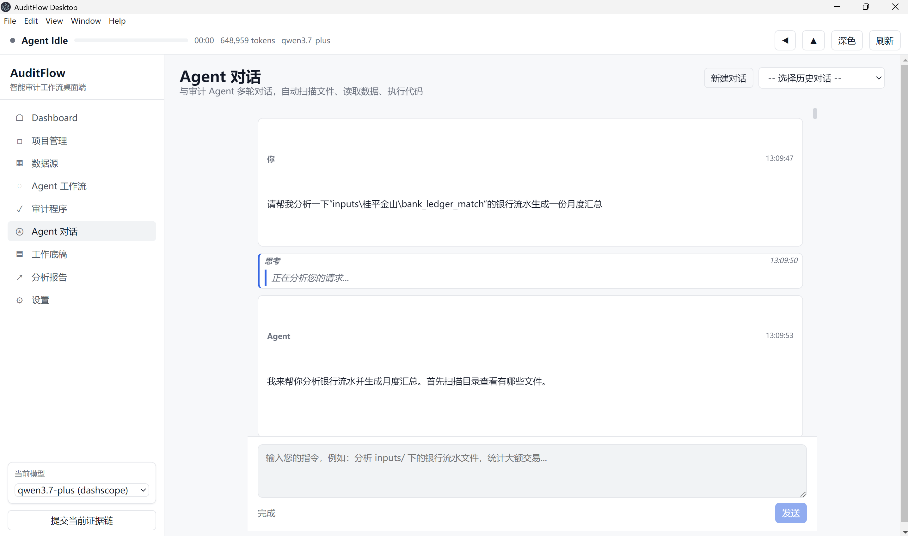
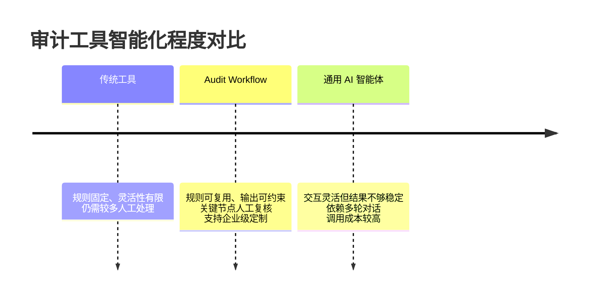

# Audit Workflow｜智能审计工作流

## 让重复工作自动化，让专业判断回归审计本身

在审计项目中，序时账与银行流水匹配、出库数据与平台结算核对、工商信息查询、文件批量整理等工作，往往耗时长、重复度高，却又直接影响项目进度和交付质量。

现有工具通常存在两类问题：

- **传统审计工具灵活性不足**：规则相对固定，难以直接适配不同团队的底稿模板和项目要求，仍需投入大量人工进行整理与复核。
- **通用 AI 智能体稳定性不足**：往往需要多轮对话才能得到符合要求的结果，输出格式难以严格约束；任务规则不易复用，也会带来较高的 Token 成本。

## 我们的解决方案

**Audit Workflow** 将审计方法、自动化程序与 AI 能力整合为可复用的标准工作流，并根据企业或项目团队的实际需求进行定制。

它可以帮助团队：

- 自动完成数据清洗、匹配、汇总及批量文件处理；
- 按既定规则输出结果，适配审计底稿及内部模板；
- 在关键判断节点引入人工复核，并提供清晰、可交互的核查界面；
- 将成熟规则沉淀为可复用流程，减少重复配置和沟通成本；
- 通过“代码复用 + 工作流编排”降低大模型调用量，提高执行效率；
- 根据企业制度、项目类型和团队习惯持续迭代。

## 效率与成本优势

以下为同一项“根据银行流水生成月度总结，并自动完成格式处理”任务的测试结果：

| 执行方式 | Token 使用量 | 估算费用（人民币） |
| --- | ---: | ---: |
| 通用 Agent Loop | 输入 639,413；输出 9,546 | 约 1.97 元 |
| Audit Workflow | 输入 682；输出 1,636 | 约 0.012 元 |

> 测试价格按 DeepSeek V4 Pro 输入未命中 3 元/百万 Token、输出 6 元/百万 Token 估算。实际费用会因模型、任务复杂度及服务商计费规则而变化。本数据用于说明工作流复用在特定任务中的降本潜力，不代表所有场景均可获得相同比例的节省。

## 适用场景

- 审计：流水匹配、凭证核查、函证及底稿辅助、资料整理；
- 财务：多来源数据核对、报表汇总、异常筛查；
- 税务：申报数据整理、勾稽关系检查、批量资料处理；
- 其他需要大量结构化数据处理、规则判断和人工复核的业务场景。

## 合作模式

我们希望与审计、财税、咨询及企业服务领域的合作伙伴共同拓展应用场景。合作方式可根据双方资源投入和项目阶段灵活组合：

### 1. 项目联合交付

合作伙伴负责客户需求梳理、行业经验支持或项目实施，我们负责工作流设计、技术开发与后续优化。项目回款扣除双方确认的直接成本后，按照实际投入和职责约定进行收益分成。

### 2. 客户推荐与渠道合作

合作伙伴推荐客户并促成签约，可按首期合同金额或实际回款获得渠道佣金；如持续参与客户维护，也可约定续费分成。具体比例根据项目规模、获客投入和服务范围协商确定。

### 3. 联合产品开发

双方共同选择具有复制价值的审计或财税场景，联合投入行业知识、客户资源和研发能力。产品上线后，可按资金、技术、知识产权及市场投入约定长期收益分配机制。

### 4. 定制服务合作

针对事务所、企业财务部门或特定行业客户，由我们提供私有化部署、模板适配、功能定制和培训支持；合作伙伴可作为项目顾问、实施方或区域服务方参与，并获得相应服务收益。

### 5. 深度战略合作

对于能够持续提供行业资源、产品能力或市场渠道的伙伴，可进一步探讨联合品牌、区域合作、年度收益分配等长期合作安排。涉及股权或公司利润分红的合作，将在明确投入、权责和退出机制后另行签署专项协议。

所有合作项目均建议遵循“**投入可衡量、过程可追踪、回款可核验、分配有依据**”的原则，并通过正式协议明确客户归属、交付责任、成本口径、结算周期、知识产权和保密义务。

## 服务与定价

基础服务拟采用按月订阅模式，客户可根据项目周期灵活启用，也可仅在年审季订阅。具体费用将结合使用人数、工作流数量、定制程度和部署方式确定；模型调用费用可按实际使用量单独结算，确保成本透明、可控。

## 市场参考

1. [尊创 AI 智能体应用](https://agentic.zunchuang.tech/cases)：面向企业提供智能体应用及定制交付服务。
2. [效率视界 AI 智能体](https://mp.weixin.qq.com/s/0O-acMOPa1bAe6QnQhOEhQ)：面向审计业务的 AI 工具实践。
3. [个人开发者-风吹过梦](https://cpafml.com/audit)

## 期待合作

如果您拥有审计、财税或企业服务领域的客户资源、业务经验或典型应用场景，欢迎与我们共同验证需求、打磨产品并拓展市场。我们愿以开放、透明、长期共赢的方式，与合作伙伴共同分享产品成长带来的价值。
