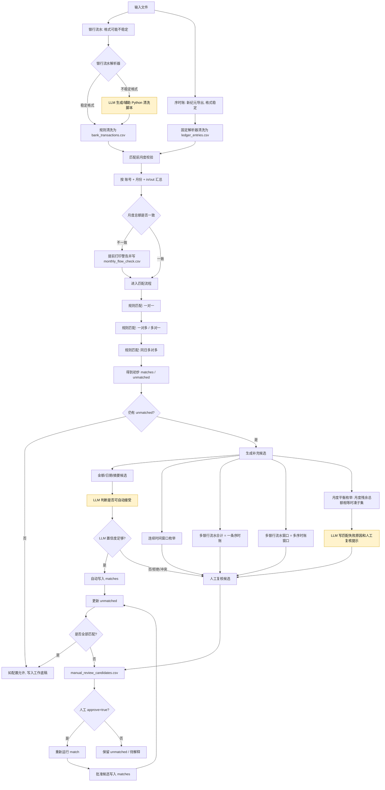

# Audit Workflow: 资金流水专项核查

这套工作流用于把银行流水和新纪元序时账清洗成标准 CSV，自动匹配银行流水与账面记录，并把结果填入资金流水专项核查底稿。

## 设计原则

- 银行流水格式不稳定：优先使用已知固定解析器；未知格式可让 LLM 生成 Python 解析脚本，并缓存到 `generated_parsers/` 复用。
- 新纪元序时账格式稳定：使用固定解析器 `xinjiyuan_bank_ledger`，不调用 LLM。
- 匹配结果保留置信度、未匹配清单和低置信信息，方便审计人员复核。
- 原始 Excel 不改动，输出统一写入 `outputs/`。

## 快速运行

```powershell
python -m audit_workflow.bank_ledger_match run -c config.example.yml
```

运行后会生成：

- `outputs/clean/bank_transactions.csv`
- `outputs/clean/ledger_entries.csv`
- `outputs/matches/matches.csv`
- `outputs/matches/unmatched_bank.csv`
- `outputs/matches/unmatched_ledger.csv`
- `outputs/working_paper/资金流水专项核查工作底稿-自动填报.xlsm`

## LLM / PydanticAI 配置

LLM 交互统一通过 PydanticAI agent 发起，支持 OpenAI 兼容接口。不要把 API key 写进聊天记录或提交到代码库。复制 `.env.example` 为 `.env`，按实际服务填入：

```text
OPENAI_API_KEY=你的key
OPENAI_MODEL=你要使用的模型名
OPENAI_BASE_URL=兼容接口地址
```

也可以在 `config.example.yml` 的 `matching.llm` 中使用 `api_key_env`、`base_url_env`、`model_env` 指向服务商环境变量。然后把需要的 `llm.enabled` 或 `matching.llm.enabled` 改为 `true` 即可。

## 常用命令

```powershell
python -m audit_workflow clean -c config.example.yml
python -m audit_workflow match -c config.example.yml
python -m audit_workflow fill -c config.example.yml
```

## 格式扩展

新增稳定银行格式时，在 `audit_workflow/cleaners.py` 新增解析器函数，并在配置中指定 `parser`。

银行格式不稳定时，将配置中的银行流水 `parser` 设为 `llm_bank`。首次运行会根据 Excel 样例行生成 `generated_parsers/{输入id}.py`，之后同类格式会直接复用该脚本。

## 匹配原则


