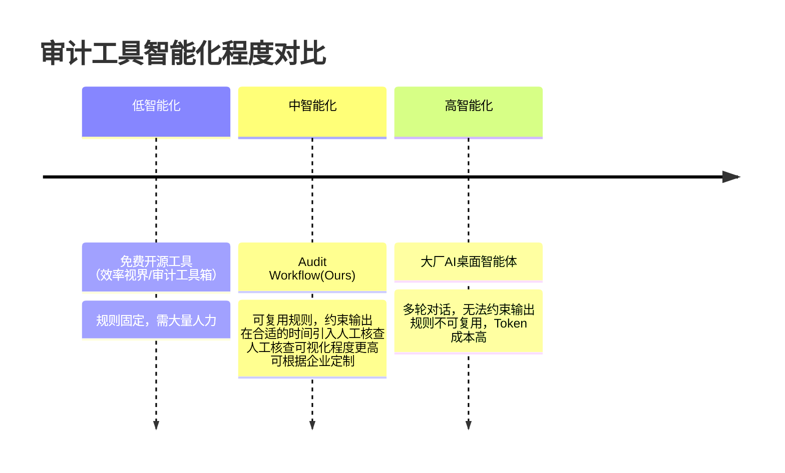

# Audit Workflow
## 痛点
当前审计流程会出现众多的重复性劳动，比如序时账-银行流水匹配，出库表-平台结算匹配，工商信息查询，批量的文件处理等等。这些重复运行劳动虽然有一些免费的开源工具可以使用（效率视界/审计工具箱），但是这些开源工具ai智能程度低，不能与模板要求直接适配，依然需要大量人力解决。

当前互联网大厂推出自家的AI桌面智能体（比如Qwork），但是这些智能体并没有办法直接约束输出格式，通常需要多轮对话才能完成；规则无法复用，每一次任务都需要重新编写prompt，多轮对话导致token调用量暴增，严重增加成本。

同样是对银行流水生成月度总结（自动处理格式并给出结果），以下是使用agent_loop调用和使用工作流调用的token数比较：
所有价格计算使用输入未命中的价格计算，使用deepseekv4pro。输入未命中 3 元/百万 Token，输出 6 元/百万 Token。
| 执行方式 | token总数 | 价格（RMB）|
|---------| ----------|-----|
| agent_loop | 'request_tokens': 639413, 'response_tokens': 9546 | 1.97 |
| audit_flow| 仅代码生成，'prompt_tokens': 682, 'completion_tokens': 1636 |0.011862 |

因此我们推出audit_workflow智能体：结合通用的审计工具和审计团队特殊的定制化需求，该智能体能够
- 完成数据处理及其他任务
- 在合适的时机引入人工核查，可交互的人工核查界面
- 降低token调用量：代码重用机制，工作流设计

该套设计理念可以拓展到任何需要大量数据处理的场景，比如税务等。

## 竞品调研
1. 尊创AI智能体应用：与本应用生态位相似。To B 交付，10-100w. 当前依然正在开发。
https://agentic.zunchuang.tech/cases
2. 效率视界作者制作的ai智能体。目前的功能设计有限
https://mp.weixin.qq.com/s/0O-acMOPa1bAe6QnQhOEhQ

## 定价策略
按月订阅制，可只在年审季订阅。
月订阅费用初定为月实习生工资。token费用另计？
