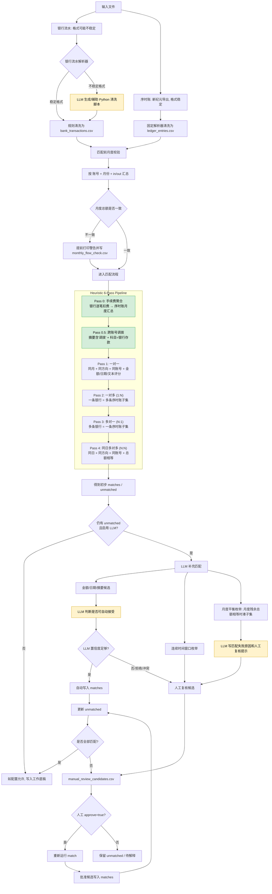
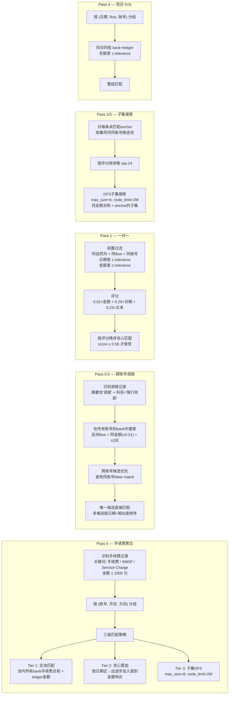

# Bank_ledger_match (5017)

## 设计原则
这套工作流用于把银行流水和新纪元序时账清洗成标准 CSV，自动匹配银行流水与账面记录，并把结果填入资金流水专项核查底稿。
- 数据清洗
  - 银行流水格式不稳定：优先使用已知固定解析器；未知格式可让 LLM 生成 Python 解析脚本，并缓存到 `generated_parsers/` 复用。
  - 新纪元序时账格式稳定：使用固定解析器 `xinjiyuan_bank_ledger`，不调用 LLM。
- 匹配流程
  - 匹配前引入月度总数匹配，判断数据是否缺漏
  - 匹配时引入LLM
  - 匹配结果保留置信度、未匹配清单和低置信信息，方便审计人员复核。
  - 原始 Excel 不改动，输出统一写入 `outputs/`。
- 填入底稿
  - 使用固定解析器，填入底稿


## 匹配原则



## Heuristic 各 Pass 详细逻辑



### 各 Pass 设计要点

| Pass | 解决的问题 | 触发条件 | 关键参数 |
|------|-----------|---------|---------|
| **0** | 银行逐笔扣手续费（4.5~100元×20笔），序时账按月汇总为1条 | 关键词 `手续费/SMSP/Service Charge` 且金额 ≤ 1000元 | 三级策略: 全池→贪心→DFS(8) |
| **0.5** | 跨银行账号资金调拨，同账号约束无法匹配 | 摘要含 `调拨` 且会计科目 = `银行存款` | 反向flow + ±3天 + 跨账号优先 |
| **1** | 最常见的逐笔对应交易 | 同月 + 同方向 + 同账号 + 金额/日期在容差内 | score ≥ 0.58, 权重 0.52/0.25/0.23 |
| **2/3** | 一笔银行对应多条序时账（或反之） | 未匹配的anchor记录 | pool=24, max_size=6 |
| **4** | 同日同账号同方向批量匹配 | 同日分组后bank+ledger总额相等 | 仅限同日 |

### 记录加载 (`_records`)

`_records()` 从清洗后的 CSV 加载记录，对 `amount=0` 的记录有 fallback 逻辑：

```
if amount_cents ≤ 0:
    检查 ledger_debit / ledger_credit (bank侧检查 bank_debit / bank_credit)
    debit > 0  → amount = debit,  flow = in(ledger) / out(bank)
    credit > 0 → amount = credit, flow = out(ledger) / in(bank)
```

此 fallback 用于处理清洗脚本将负金额错误设为 0 的情况。若原始 debit 和 credit 均为 0 则无法恢复（属清洗层数据质量问题）。

### 子集搜索 (`_find_subset`)

使用 DFS 在候选池中搜索金额总和等于目标的子集。按金额降序排列候选以加速剪枝。

安全机制：`node_limit=2,000,000` — 超过此搜索节点数即停止，返回已找到的最优结果（或空）。防止 `max_size` 较大时组合爆炸（如 C(50,8) ≈ 5.4亿）。

## 输入内容
- 底稿模板
- 银行流水
- 序时账
## 输出内容
- 清洗后的序时账 `clean/ledger_entries.csv`
- 清洗后的银行流水 `clean/bank_transactions.csv`
- 月度总数匹配  `matches/monthly_flow_check.csv`
- 匹配结果 `matches/matches.csv`
- 未匹配银行流水  `matches/unmatched_bank.csv`
- 未匹配序时账 `matches/unmatched_ledger.csv`
- 需要人工审核的条目 `matches/manual_review_candidates.csv`
- 最终的底稿`working_paper/资金流水专项核查工作底稿-自动填报.xlsm`

## 后端接口测试命令

```powershell
python -m audit_workflow clean -c config.example.yml
python -m audit_workflow match -c config.example.yml
python -m audit_workflow fill -c config.example.yml
```

## 格式扩展

新增稳定银行格式时，在 `audit_workflow/cleaners.py` 新增解析器函数，并在配置中指定 `parser`。

银行格式不稳定时，将配置中的银行流水 `parser` 设为 `llm_bank`。首次运行会根据 Excel 样例行生成 `generated_parsers/{输入id}.py`，之后同类格式会直接复用该脚本。
