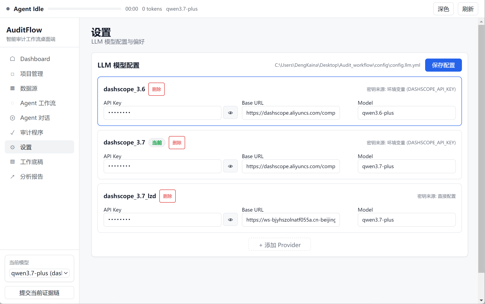
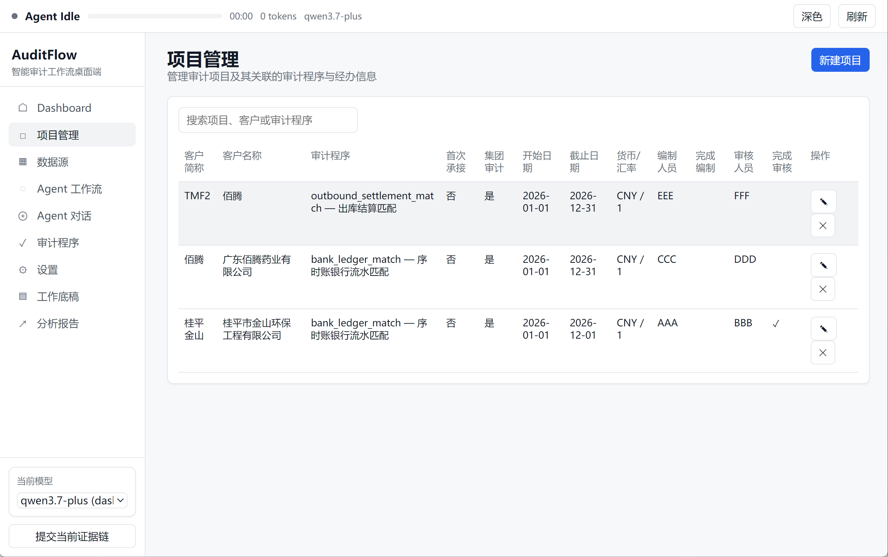
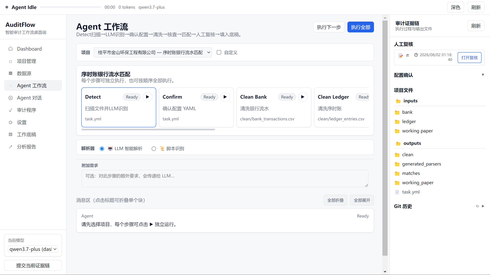

# AuditFlow使用手册

produced by dengkn@mail2.sysu.edu.cn

当前版本v0.1.0实现了以下功能：项目管理、序时账银行流水匹配、销售单出库表匹配。

## 1. 填写大模型配置

使用任意大模型平台（deepseek/qwen/中转站）获取base_url和api_key.

## 2. 项目管理

添加项目信息，并上传对应数据到文件夹。这些数据会在后期被整合入底稿中。

打包文件中已经预设几个样例数据供使用。

## 3. 运行工作流。

选择需要的任务运行工作流。

可以在附加需求中增加额外的需求到预设提示词，比如在清洗数据的时候增加“请帮我排除12月的数据”。
解析器有：LLM解析（如有已经生成的代码直接复用，适合代码正确但数据有变更的情况）/LLM重新生成（删除原来生成的代码，适合代码需要变化的情况）
软件优势:

1) 并发调用，提高速率
2) 增加生成代码缓存，减少token用量
3) 使用步骤式工作流而不是单纯的skill，增加验证环节，确保步骤正确
